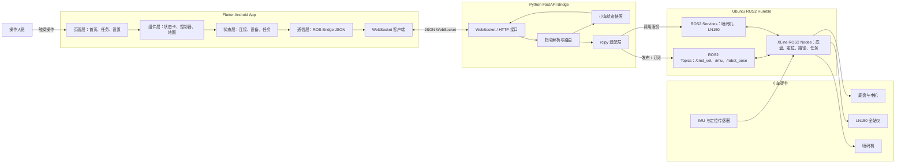

# XLine 划线小车 App 架构图

Mermaid 原始文件：`App架构图.mmd`

PNG 图片：`App架构图.png`

cd /d D:\xikao\test1
D:\flutter\bin\flutter.bat clean
D:\flutter\bin\flutter.bat pub get --offline
D:\flutter\bin\flutter.bat test
D:\flutter\bin\flutter.bat build apk --release
D:\ai\android\platform-tools\adb.exe -s emulator-5554 install -r D:\xikao\test1\build\app\outputs\flutter-apk\app-release.apk