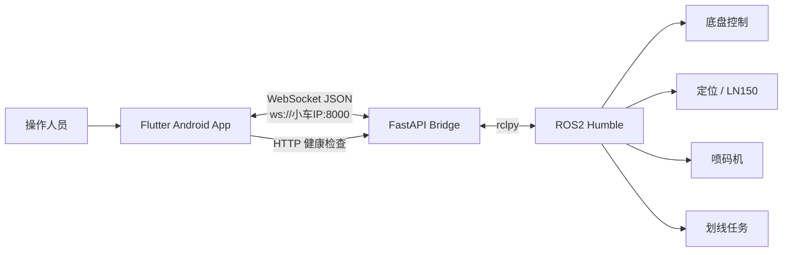
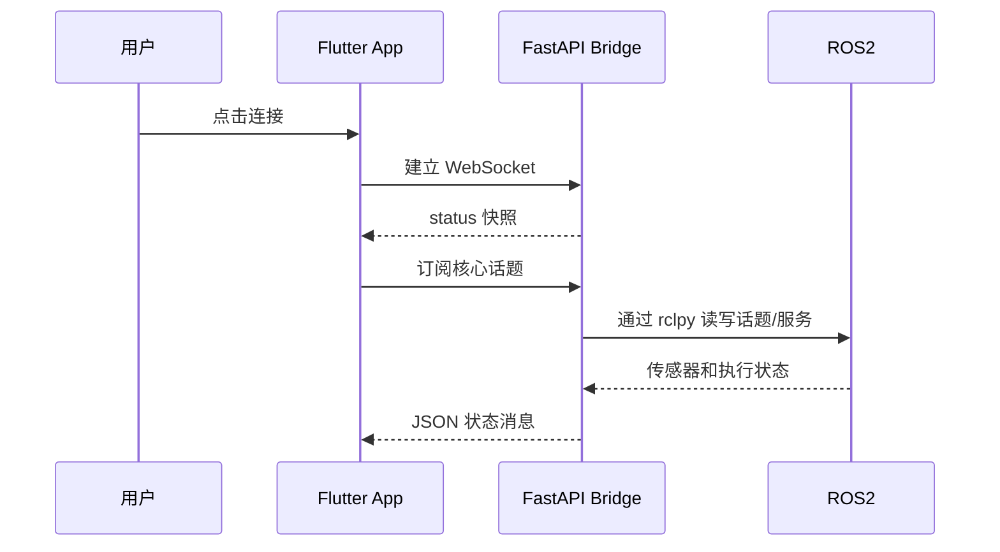
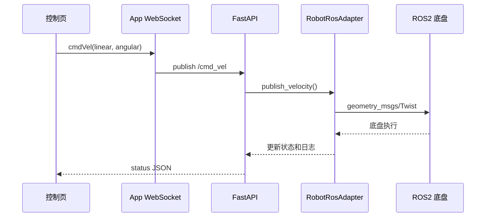

# XLine 划线小车 App 架构说明

## 1. 项目概述

本项目是一套用于 XLine 划线小车的移动控制系统，由以下三部分组成：

1. Flutter Android App：负责设备连接、状态展示、手动控制和任务操作。
2. FastAPI Bridge：负责在 App 的 WebSocket/HTTP 消息与 ROS2 之间转换。
3. ROS2 小车系统：负责底盘、定位、LN150、喷码机和划线任务的实际执行。

## 2. 总体架构



默认连接参数：

```text
小车 IP：192.168.0.100
后端端口：8000
WebSocket：ws://192.168.0.100:8000
ROS Domain ID：0
```

## 3. App 页面架构

App 底部仅保留三个一级入口：

```text
App
├── 首页
│   ├── 连接状态
│   ├── 实时数据
│   ├── 地图与路径
│   ├── 手动控制
│   └── 设备管理
├── 任务
│   ├── 划线任务
│   ├── LN150 指令
│   └── 喷码同步
└── 设置
    ├── 当前设备
    ├── 划线宽度
    └── 控制模式
```

### 离线状态

当 App 无法连接小车时：

- 不显示电量、速度、定位、喷码和地图等状态数据。
- 地图与手动控制入口自动禁用。
- 任务页显示连接引导。
- 移动、喷码和任务指令不会在离线状态下发送。
- 设备管理保持可用，便于修改 IP 或重新连接。

## 4. Flutter 客户端分层

### 基本目录结构

```text
- lib
  |
  |-- api             # 存放网络请求、WebSocket 和 ROS Bridge 接口配置
  |
  |-- assets          # 存放图片、图标、字体等资源说明
  |
  |-- components      # 存放按钮、面板、状态卡等公共组件
  |
  |-- constants       # 存放 IP、端口、Topic 和全局常量
  |
  |-- viewmodels      # 存放小车设备、遥测和任务数据模型
  |
  |-- pages           # 存放首页、任务、设置等页面
  |
  |-- routes          # 存放页面路由配置
  |
  |-- stores          # 存放连接、遥测和任务全局状态
  |
  |-- utils           # 存放 ROS JSON 构建器和通用工具类
  |
  `-- main.dart       # Flutter App 入口
```


### 当前实际文件

```text
lib/
├── main.dart                     # App 入口、页面组合、当前主状态与交互逻辑
├── api/
│   └── ros_bridge_api.dart       # Bridge 端口、话题与服务常量
├── components/
│   └── app_panel.dart            # 可复用面板组件
├── constants/
│   └── app_constants.dart        # App 名称、默认设备和核心话题
├── routes/
│   └── app_routes.dart           # 路由名称配置
├── stores/
│   └── connection_store.dart     # 连接状态存储结构
├── utils/
│   └── ros_messages.dart         # ROS Bridge JSON 消息构建器
└── viewmodels/
    └── rover_device.dart          # 小车设备数据模型
```

### 当前状态管理

当前运行状态主要由 `RoverHomePage` 内的 `State` 管理，包括：

- 底部栏当前页面。
- 首页当前子模块。
- WebSocket 连接和消息订阅。
- 当前小车设备。
- 任务、喷码机、速度和划线宽度状态。
- Bridge 连接日志。

本项目当前未引入第三方状态管理库，仅使用 Flutter 自带的 `StatefulWidget` 和 `setState`。

## 5. App 通信层

App 使用 Dart `WebSocket` 与小车后端建立长连接。

### 连接流程



### App 发送的消息

#### 底盘速度

```json
{
  "op": "publish",
  "topic": "/cmd_vel",
  "type": "geometry_msgs/msg/Twist",
  "msg": {
    "linear": {"x": 0.2, "y": 0.0, "z": 0.0},
    "angular": {"x": 0.0, "y": 0.0, "z": 0.0}
  }
}
```

#### 划线任务

```json
{
  "op": "publish",
  "topic": "/xline/mission_control",
  "type": "std_msgs/msg/String",
  "msg": {"data": "start_line_task"}
}
```

#### 喷码机服务

```json
{
  "op": "call_service",
  "service": "/printer/quick_command",
  "type": "xline_msgs/srv/QuickCommand",
  "args": {
    "printer_name": "center",
    "action": "start_print",
    "param": 0
  }
}
```

#### LN150 服务

```json
{
  "op": "call_service",
  "service": "/ln_driver/command_srv",
  "type": "xline_msgs/srv/LnCommand",
  "args": {"command_type": 1}
}
```

## 6. FastAPI Bridge 后端架构

```text
backend/
├── requirements.txt             # Python 依赖
├── README.md                    # 后端启动说明
└── app/
    ├── main.py                  # HTTP/WebSocket 路由和消息分发
    ├── config.py                # ROS2 话题与服务名称
    ├── schemas.py               # API 请求和响应模型
    ├── state.py                 # 后端小车状态快照
    ├── ros_adapter.py           # rclpy 节点、发布者、订阅者与服务客户端
    └── __init__.py
```

### 后端接口

| 方法 | 路径 | 功能 |
| --- | --- | --- |
| GET | `/health` | 检查后端、ROS2 和小车状态 |
| GET | `/api/status` | 获取小车状态快照 |
| GET | `/api/logs` | 获取后端日志 |
| POST | `/api/cmd_vel` | 发送底盘速度 |
| POST | `/api/printer/quick_command` | 调用喷码机服务 |
| POST | `/api/ln150/command` | 调用 LN150 服务 |
| POST | `/api/mission/control` | 启动或停止划线任务 |
| WebSocket | `/` | App 默认的 ROS Bridge 兼容通道 |
| WebSocket | `/ws/rosbridge` | ROS Bridge 兼容通道 |
| WebSocket | `/ws/status` | 状态推送通道 |

## 7. ROS2 适配层

`RobotRosAdapter` 是 FastAPI 与 ROS2 之间的边界。

其主要职责包括：

- 初始化 `rclpy`。
- 在独立线程中运行 ROS2 Spin。
- 向 `/cmd_vel` 发布 `Twist` 速度消息。
- 向 `/xline/mission_control` 发布任务指令。
- 调用喷码机与 LN150 的 ROS2 Service。
- 订阅 IMU、位姿、反射镜位置和喷码机状态。
- 在没有 ROS2 的开发电脑上进入 `simulated` 模式。

正式连接小车时，`/health` 应返回：

```text
ros_available = true
bridge_mode = rclpy
online = true
```

## 8. 指令数据流

以“前进”为例：



## 9. 安全设计

当前 App 已实现以下基础保护：

- Bridge 未连接时拦截控制与任务指令。
- 停止任务时同时停止喷码并发送零速度。
- 离线时不展示可能被误认为实时值的状态卡片。
- 通信日志保留最近的连接和指令记录。

真机验收前建议继续增加：

- 按下保持、松开立即停止的安全遥控模式。
- 指令心跳超时后底盘自动停止。
- 独立的急停按钮和硬件急停联动。
- WebSocket 断线自动重连与指数退避。
- 设备身份认证和通信加密。

## 10. 当前实现边界

为了准确理解当前项目，需要注意：

- App 已能建立 WebSocket 连接并生成 ROS Bridge JSON 指令。
- FastAPI 已能将底盘、任务、喷码机和 LN150 指令转换为 ROS2 操作。
- App 当前对后端状态消息主要进行日志记录，还需要将 JSON 状态完整解析到电量、位姿和喷码等 UI 数据模型。
- 连接成功后的部分状态卡和地图仍包含界面演示值，真机验收前应全部替换为 ROS2 实时数据。
- 当前主页面和大部分交互集中在 `main.dart`，功能继续扩大时应拆分到 `pages`、`components`、`stores` 和 `viewmodels`。

## 11. 建议的目标分层

```text
UI Pages
   ↓
Reusable Components
   ↓
ViewModels / Stores
   ↓
Robot Repository
   ↓
WebSocket + HTTP Client
   ↓
FastAPI Bridge
   ↓
ROS2 Adapter
   ↓
XLine ROS2 Nodes
```

后续拆分原则：

- `pages`：只负责页面布局与用户交互。
- `components`：存放状态卡、设备行、操作按钮等可复用组件。
- `viewmodels`：存放设备、遥测、任务和路径数据模型。
- `stores`：管理连接、遥测和任务状态。
- `api`：封装 WebSocket、HTTP、重连和超时逻辑。
- `utils`：只保留无状态的消息构建与工具函数。

## 12. 构建与产物

构建 release APK：

```powershell
flutter build apk --release
```

生成的安装包：

```text
D:\xikao\test1\build\app\outputs\flutter-apk\app-release.apk
```

安装到 Android 模拟器：

```powershell
D:\ai\android\platform-tools\adb.exe -s emulator-5554 install -r D:\xikao\test1\build\app\outputs\flutter-apk\app-release.apk
```
