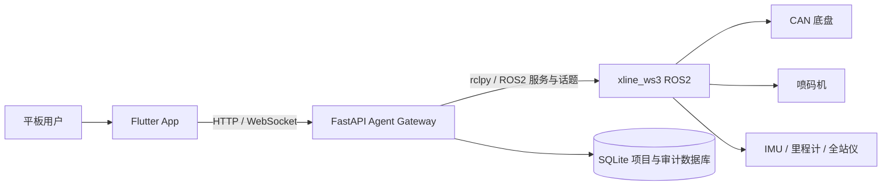

# X-LINE2 项目交接文档

> 更新日期：2026-08-25
> 项目目录：`D:\xikao\test1`
> 当前分支：`version5`
> 基础提交：`c04c417`（当前工作区包含尚未提交的 ws3 最终适配，交接时必须连同工作区修改一起提交或传递）
> 适用对象：Flutter 前端、FastAPI 后端、ROS2 小车联调与现场交付人员

## 1. 项目概述

X-LINE2 是面向划线/喷墨小车的平板端控制与 AI Agent 系统。系统将自然语言设计、图纸编辑、路径规划、人工确认、ROS2 执行、分段验证、异常恢复和验收报告串成一个可审计流程。

系统边界如下：



职责原则：

- Flutter App 负责交互、状态展示、人工确认和可视化，不直接操作 CAN。
- FastAPI 后端负责 Agent、工具门禁、状态聚合、持久化、任务编排和 ROS2 适配。
- `xline_ws3` 负责底盘、定位、规划、跟踪、速度仲裁和喷码机驱动。
- 数据库保存项目与历史，不作为急停、控制权、CAN、定位等实时安全状态的唯一来源。

## 2. 目录与修改边界

| 目录 | 用途 | 修改规则 |
|---|---|---|
| `D:\xikao\test1\lib` | Flutter 前端 | 主要业务 UI 和设备连接逻辑 |
| `D:\xikao\test1\backend` | FastAPI/Agent 后端 | 修改后必须更新 `后端最终同步清单.md` |
| `D:\xikao\test1\assets` | 图标、离线语音模型等 | 大模型资源会显著增大 APK |
| `D:\xikao\test1\test` | Flutter 测试 | 前端变更后由项目负责人执行 |
| `D:\xikao\test1\backend\tests` | Python 后端测试 | 后端同步前必须执行 |
| `D:\xikao\xline_ws3` | 本地 ROS2 最新源码参考 | 默认只读，不得随 App 后端修改 |
| `/home/qingz/xline_cyg_app_backend` | 旧 `xline_cyg` 小车后端 | 仅归档，服务禁用，不参与当前运行 |
| `/home/qingz/xline_app_backend1` | 新 `xline_ws3` 后端目录 | 已完成首次完整同步，后续按最终同步清单维护 |
| `/home/qingz/xline_ws3` | 小车 ROS2 运行代码 | 未经明确授权禁止修改 |

小车连接信息：

```text
SSH: qingz@192.168.0.100
Backend: http://192.168.0.100:8000
WebSocket: ws://192.168.0.100:8000
ROS2: Humble
新 xline_ws3 service: xline-app-backend1.service
ROS2 runtime: xline-ws3-runtime.service（独立常驻、开机自启）
```

2026-08-25 已完成 ws3 后端首次完整部署。当前只运行 ws3，旧 cyg 目录仅作归档，后端切换功能已经移除。后续维护人员仍应按第 10 节执行检查并保存服务状态和 `/api/status`。不要把密码、AI API Key 或其他密钥写进 Git、APK 或本文档。AI Key 只放在小车的 `/home/qingz/.config/xline-agent-ws3.env`。

## 3. 当前功能快照

### 3.1 平板端

- 多设备配置、连接、断开和状态恢复。
- 首页状态、实时地图、相对定位/全站仪定位显示。
- 固定式虚拟摇杆控制，速度经 `/tablet_cmd_vel` 进入速度仲裁。
- 喷码机连接状态、手动喷墨开关、测试和停止控制。
- 图纸模板、绘图工具、撤销/重做、缩放/平移/旋转和版本保存。
- 地图/图纸坐标系随视口动态绘制，缩放或平移后继续铺满可见区域。
- 任务规划、确认、执行、暂停、恢复、验收和报告展示。
- AI 助手基础模式与进阶模式使用独立会话。
- 会话复制、引用、删除单个会话和清空会话。
- Agent 与图纸编辑器输入框支持离线中文语音转文字。

### 3.2 基础模式

定位为快速、允许误差的运动演示：

```text
自然语言要求
  -> 本地 Skill 或 AI 解析
  -> 运动 JSON
  -> 地图预览
  -> 用户确认
  -> ROS2 底盘工具执行
```

- 支持前进、后退、转弯、圆、矩形、球场等可拆分轨迹。
- 允许同一会话连续提交多次运动，不能把上次结束状态误当成永久锁定。
- 默认不喷墨。
- 用户可手动打开“喷墨”开关，也可明确要求 AI 生成喷墨确认动作。
- 喷墨开启后，运动演示可同时喷墨；关闭、断连、控制权超时或急停时必须停止喷墨。
- 基础模式不创建项目，不进入项目状态机，不用于高精度施工验收。

### 3.3 进阶模式

定位为项目化设计与执行闭环：

```text
需求收集 -> 参数完整性检查 -> 创建项目 -> 候选方案
-> 选择方案 -> 版本化 JSON 图纸 -> 可制造性检查
-> ROS2 规划 -> 质量评分 -> 用户确认 -> 安全门禁
-> 分段执行 -> 分段验证 -> 异常恢复 -> 轨迹对比
-> 验收报告与审计归档
```

- 页面显示当前项目步骤和下一步建议，Agent 应主动追问缺失参数。
- 项目没有完整路径时，不允许把“已创建项目”误显示为“可执行”。
- 恢复流程包括重新规划、避免重复喷墨和再次确认。
- 图纸版本、规划任务、执行分段和项目状态以数据库为主存储。
- 关键工具调用与任务审计独立于聊天记录，删除会话不能删除项目或审计。

## 4. 定位与路径执行

系统支持两类视觉和执行区域：

| 模式 | 坐标来源 | 使用方式 |
|---|---|---|
| 全站仪任务执行 | LN150/绝对坐标 | 定位有效且质量满足门禁后进行精确规划和执行 |
| 相对定位任务执行 | `/odom` + IMU | 无全站仪时，将校准时车体位置设为 `(0,0)`，车头方向设为坐标正方向 |

后端已订阅 `/odom`，并结合 `/robot_pose`、`/imu`、`/localization/valid` 等状态。相对定位适用于演示或短距离任务，其累计误差不能等同于全站仪精度。

当前默认运动限制：

```text
手动默认线速度：0.10 m/s
手动最大线速度：1.00 m/s
最大角速度：0.40 rad/s
轮半径：0.09115 m
轮距：0.255 m
```

正方形距离、转角不准或左右摆头通常需要同时检查轮径/轮距标定、轮胎打滑、实际里程计、控制器参数和定位反馈，不能只靠 App 的定时速度命令修正。

## 5. 喷码机闭环

`xline_ws3` 当前协议语义：

```text
start_print -> 进入打印状态
simulate    -> 软件触发一次打印/喷墨
stop_print  -> 退出打印状态
```

App 中两类操作不要混淆：

- “测试”：后端执行 `start_print -> simulate -> stop_print`，约 1 秒后自动停止，不是持续喷墨开关。
- “喷墨”开关：打开后进入随车持续喷墨模式，关闭开关才主动结束；断连、租约超时和急停也会自动结束。
- “停止”：调用 `stop_print`，用于立即停止当前打印状态，实际有作用。

状态判断注意事项：

- 顶部“已连接”表示 App 已连接 FastAPI，不代表喷码机已连接。
- 喷码机应优先依据 `printer_status.connected` 和状态文本判断 TCP 连接。
- `is_online=false` 可能只是喷码机 ping 诊断失败，不能单独覆盖 `connected=true`。
- `enabled=true` 表示喷墨已激活；前端显示应使用 `connected && enabled`，防止断连后保留绿色开关。

真实出墨仍属于现场安全验收项。测试前需放置测试材料、确保急停可触达，并同时观察后端日志中的 `start_print`、`simulate` 和 `stop_print`。

## 6. 离线语音识别

当前 Agent 和图纸编辑器均使用本地离线中文 ASR，不依赖平板系统语音服务。原因是目标设备 HarmonyOS 6.1 的 Android 兼容环境没有可用的系统 `SpeechRecognizer`。

实现位置：

```text
lib/services/offline_speech_service.dart
assets/asr/paraformer-zh-en/model.int8.onnx
assets/asr/paraformer-zh-en/tokens.txt
```

实际模型为 Zipformer CTC 中文 int8，资源目录名 `paraformer-zh-en` 是历史名称。修改目录名时必须同步修改 `pubspec.yaml` 和服务中的资源路径。

识别流程：48 kHz 单声道 WAV 录音 -> WAV 解析 -> 音量/DC 修正 -> Sherpa ONNX 离线识别 -> 项目术语纠正。图纸编辑器识别结果只填入输入框，不自动生成图形，仍需用户检查并提交。

模型约 350 MiB，是 APK 达到约 400 MiB 的主要原因。当前 Release APK 为：

```text
D:\xikao\test1\build\app\outputs\flutter-apk\app-release.apk
构建时间：2026-08-23 21:20:24
文件大小：421,304,819 bytes
```

语音精度仍会受远场拾音、环境噪声、说话速度和施工术语影响。后续优先方向是近讲提示、VAD 分段、领域热词/上下文偏置和现场语料评测，而不是仅提高录音增益。

## 7. Flutter 代码结构

| 文件 | 主要职责 |
|---|---|
| `lib/main.dart` | App 根状态、设备连接、WebSocket、状态分发和预览模式 |
| `lib/constants/app_constants.dart` | 名称、端口、速度上限、预览开关 |
| `lib/pages/dashboard_page.dart` | 首页、快捷操作、地图与设备状态 |
| `lib/pages/control_page.dart` | 固定摇杆和喷码机开关 |
| `lib/pages/map_page.dart` | 实时地图和定位模式 |
| `lib/pages/mission_page.dart` | 规划、任务执行与验收区域 |
| `lib/pages/agent_page.dart` | 基础/进阶 Agent、会话、确认动作和 AI 路径预览 |
| `lib/pages/drawing_editor_page.dart` | 图纸模板、编辑、无限网格和语音输入 |
| `lib/components/map_components.dart` | 地图与路径绘制组件 |
| `lib/utils/ros_messages.dart` | 后端/ROS 状态消息解析 |
| `lib/services/offline_speech_service.dart` | 本地录音与离线 ASR |

前端大量页面采用 `part of '../main.dart'` 组织。新增文件或拆分模块时要保持现有 `part` 关系，避免同时使用不兼容的独立 import 结构。

## 8. 后端结构

| 文件 | 主要职责 |
|---|---|
| `backend/app/main.py` | FastAPI 路由、WebSocket、控制与喷码入口 |
| `backend/app/ros_adapter.py` | ROS2 订阅/发布/服务、状态、安全与执行适配 |
| `backend/app/agent_service.py` | 两种 Agent 模式、对话和工具编排 |
| `backend/app/agent_skills.py` | 本地运动、设计、检查和恢复 Skill |
| `backend/app/tooling.py` | 工具 Schema、动态工具选择和安全门禁 |
| `backend/app/database.py` | SQLite 主存储、迁移、备份和查询 |
| `backend/app/creative_projects.py` | 项目状态机和项目生命周期 |
| `backend/app/drawing_store.py` | 图纸读写与解析 |
| `backend/app/drawing_versions.py` | 图纸版本与回滚 |
| `backend/app/task_store.py` | 待确认动作和 Agent 任务状态 |
| `backend/app/mission_ledger.py` | 执行账本与分段记录 |
| `backend/app/mission_quality.py` | 规划质量评分 |
| `backend/app/mission_reports.py` | 验收报告 |
| `backend/app/oscillation.py` | 左右摆头检测 |
| `backend/app/trajectory_comparison.py` | 规划轨迹与实测轨迹对比 |
| `backend/app/audit_store.py` | 工具调用和审计记录 |

主要接口族：

```text
GET  /health
GET  /api/status
GET  /api/database/summary
GET  /api/database/migrations
POST /api/database/backup
POST /api/agent/chat
POST /api/agent/confirm
GET  /api/agent/device-capabilities
GET/POST/DELETE /api/agent/projects...
GET/POST /api/drawings...
POST /api/cmd_vel
POST /api/emergency-stop
POST /api/printer/quick_command
POST /api/printer/set_active
POST /api/mission/...
WS    /ws/status
WS    /ws/rosbridge
```

接口清单以 `backend/app/main.py` 为最终依据，本文只列核心入口。

## 9. 数据库

默认数据库：

```text
~/.local/state/xline-agent/xline.db
```

当前使用 SQLite、WAL 和外键约束，主存储对象包括：

- 项目和严格状态转换。
- 用户需求与结构化参数。
- 候选设计和版本化 JSON 图纸。
- 规划请求、规划结果和质量评分。
- 执行任务、执行分段和任务账本。
- 规划轨迹、实测轨迹、分段检查结果。
- 故障、恢复操作、验收报告和审计日志。

备份数据库前应先调用后端备份接口或停止写入，不能在 WAL 写入期间只复制单个 `.db` 文件并假设数据完整。

## 10. 后端部署与同步

### 10.1 交接状态与边界

最终同步来源只能依据：

```text
D:\xikao\test1\后端最终同步清单.md
```

当前状态：本地编译和后端测试已通过，完整后端已同步到
`/home/qingz/xline_app_backend1`。`xline-ws3-runtime.service` 与 `xline-app-backend1.service` 均已启用并运行，唯一的 ws3 后端监听 `8000` 端口。运行层独立常驻，单独重启后端不会重启或复制 ROS2 节点。旧 cyg 服务已禁用并停止，后端切换程序已删除。接口、运行层进程和 ROS2 图发现已核验；底盘运动、急停联锁和真实喷墨仍需现场安全验收。

部署人员必须遵守：

- 只修改 `/home/qingz/xline_app_backend1`、`/etc/systemd/system/xline-ws3-runtime.service`、`/etc/systemd/system/xline-app-backend1.service` 和 `/home/qingz/.config/xline-agent-ws3.env`。
- 不修改 `/home/qingz/xline_ws3`、`/home/qingz/xline_cyg` 或 cyg 后端源码。
- 只允许 ws3 后端监听 `8000` 端口；旧 cyg 服务必须保持 `disabled/inactive`，不得恢复切换脚本。
- 第一次解除软件急停和运动测试前必须架空车轮或清空试验区，并保证物理急停可立即触达。

### 10.2 本地部署前检查（Windows CMD）

```bat
cd /d D:\xikao\test1\backend
python -m compileall -q app
python -m unittest discover -s tests -p "test_*.py"
```

必须看到全部测试通过且没有失败。测试数量会随功能增加而变化，不应写死。不要同步 `tests`、`__pycache__`、`.pyc`、`wheelhouse`、本地数据库或 APK。

### 10.3 连接小车并检查前置条件

在能够访问 `192.168.0.100` 的电脑执行：

```bat
ping 192.168.0.100
ssh qingz@192.168.0.100
```

登录小车后执行只读检查：

```bash
test -f /home/qingz/xline_ws3/install/setup.bash && echo WS3_SETUP_OK
source /opt/ros/humble/setup.bash
source /home/qingz/xline_ws3/install/setup.bash
ros2 pkg prefix xline_bringup
ip link show can0
systemctl list-unit-files | grep -E 'xline.*(runtime|backend)'
sudo ss -lntp | grep ':8000' || true
```

若 `WS3_SETUP_OK`、ROS2 包或 `can0` 不存在，不要继续覆盖服务，应先修复小车运行环境。

### 10.4 创建备份并同步完整后端

先在小车端备份已有 ws3 后端：

```bash
stamp=$(date +%Y%m%d_%H%M%S)
if [ -d /home/qingz/xline_app_backend1 ]; then
  cp -a /home/qingz/xline_app_backend1 "/home/qingz/xline_app_backend1.backup_${stamp}"
fi
mkdir -p /home/qingz/xline_app_backend1
exit
```

回到 Windows CMD，在 `D:\xikao\test1\backend` 执行。该命令同步完整运行代码，但排除缓存：

```bat
cd /d D:\xikao\test1\backend
tar --exclude=__pycache__ --exclude=*.pyc -czf - app requirements.txt run_robot_backend.sh run_ws3_runtime.sh xline-agent.env.example README.md | ssh qingz@192.168.0.100 "tar -xzf - -C /home/qingz/xline_app_backend1"
scp xline-ws3-runtime.service xline-app-backend1.service qingz@192.168.0.100:/tmp/
```

若 Windows 的 `tar` 或管道不可用，可改用 SFTP/VS Code Remote SSH，但目标文件集合必须与
`后端最终同步清单.md` 一致，不能只上传 `main.py` 和 `ros_adapter.py`。

### 10.5 小车端安装、环境与静态检查

再次 SSH 登录后执行：

```bash
cd /home/qingz/xline_app_backend1
chmod +x run_robot_backend.sh run_ws3_runtime.sh
find app -type d -name __pycache__ -prune -exec rm -rf {} +
find app -type f -name '*.pyc' -delete
python3 -m compileall -q app
python3 -c 'import fastapi, uvicorn, pydantic; print("PYTHON_DEPS_OK")'
```

如果依赖检查失败，再执行：

```bash
python3 -m pip install --user -r /home/qingz/xline_app_backend1/requirements.txt
```

创建 ws3 独立环境文件。已有文件时不要覆盖 API Key：

```bash
mkdir -p /home/qingz/.config
if [ ! -f /home/qingz/.config/xline-agent-ws3.env ]; then
  cp /home/qingz/xline_app_backend1/xline-agent.env.example /home/qingz/.config/xline-agent-ws3.env
fi
chmod 600 /home/qingz/.config/xline-agent-ws3.env
nano /home/qingz/.config/xline-agent-ws3.env
```

至少确认以下值正确，并替换占位 API Key：

```text
XLINE_WS_DIR=/home/qingz/xline_ws3
XLINE_SETUP_FILE=/home/qingz/xline_ws3/install/setup.bash
XLINE_RUNTIME_PROFILE=xline_ws3
XLINE_BACKEND_NODE_NAME=xline_app_backend1
XLINE_USE_TOTAL_STATION=false
DEEPSEEK_API_KEY=真实密钥
```

有全站仪时才把 `XLINE_USE_TOTAL_STATION` 改为 `true`。

### 10.6 安装 ws3 常驻服务

安装服务文件：

```bash
sudo cp /tmp/xline-app-backend1.service /etc/systemd/system/xline-app-backend1.service
sudo cp /tmp/xline-ws3-runtime.service /etc/systemd/system/xline-ws3-runtime.service
sudo rm -f /usr/local/sbin/xline-backend-switch
sudo systemctl daemon-reload
```

永久停用可能占用 ROS2 节点或 `8000` 端口的 cyg/旧服务，再启用唯一的 ws3 运行层和后端：

```bash
sudo systemctl disable --now xline-cyg-app-backend.service xline-cyg-runtime.service xline-app-backend.service 2>/dev/null || true
sudo systemctl enable --now xline-ws3-runtime.service
sudo systemctl enable --now xline-app-backend1.service
sleep 15
```

### 10.7 服务、API 与 ROS2 验证

```bash
systemctl is-enabled xline-ws3-runtime.service
systemctl is-active xline-ws3-runtime.service
systemctl is-enabled xline-app-backend1.service
systemctl is-active xline-app-backend1.service
sudo systemctl status xline-ws3-runtime.service --no-pager -l
sudo systemctl status xline-app-backend1.service --no-pager -l
sudo ss -lntp | grep ':8000'
curl --fail http://127.0.0.1:8000/health
curl --fail http://127.0.0.1:8000/api/status
source /opt/ros/humble/setup.bash
source /home/qingz/xline_ws3/install/setup.bash
ros2 node list
ros2 topic list | grep -E '^/(odom|imu|robot_pose|localization/valid|printer_status)$'
ros2 service list | grep -E '^/(plan_path|printer/quick_command|printer/set_active|printer/set_enabled)$'
ros2 action list | grep '^/execute_plan$'
```

`/api/status` 至少应满足：

```text
runtime_profile = xline_ws3
vehicle.runtime.profile = xline_ws3
vehicle.motion_limits.default_linear_mps = 0.10
vehicle.motion_limits.max_linear_mps = 1.00
vehicle.motion_limits.max_task_linear_mps = 0.10
vehicle.motion_limits.max_motor_rpm = 500
vehicle.motion_limits.cmd_vel_timeout_sec = 0.50
```

若服务为 `activating`、端口未监听或接口拒绝连接，立即检查：

```bash
sudo journalctl -u xline-app-backend1.service -n 200 --no-pager -l
sudo journalctl -u xline-ws3-runtime.service -n 200 --no-pager -l
```

不要通过反复重启掩盖 `ImportError`、路径错误、ROS2 类型缺失或端口冲突。

### 10.8 App 连接与现场安全验收

1. 使用 `--dart-define=XLINE_LAYOUT_PREVIEW=false` 构建并安装 ws3 APK。
2. App 设备地址填写 `192.168.0.100`、端口 `8000`。
3. 先只检查在线、CAN、定位和急停状态，不立即发送运动。
4. 架空车轮或清空区域，以默认 `0.10 m/s` 验证前进、后退、左转、右转及摇杆松手停车。
5. 验证 App 断连、控制租约超时和软件急停都会发布零速度；物理急停必须单独验收。
6. 喷码测试先放置材料。必须确认 `/printer_status` 新鲜且 `connected=true`；若驱动提供 `device_state/print_count` 则核验计数增长，否则以现场实际出墨为最终验收依据。
7. 最后再验证 `/plan_path`、`/execute_plan`、相对定位任务以及进阶 Agent 闭环。

手动上限 `1.00 m/s` 只是 App 允许范围，不代表已完成实车安全验收。现场首次测试禁止直接使用最大值。

### 10.9 单版本运行原则

当前只支持 ws3 运行。旧 cyg 目录可以作为归档保留，但相关服务必须保持 `disabled/inactive`，不得恢复后端切换脚本，也不得与 ws3 同时启动。

后端修改规则：每次修改 `backend/app` 或启动脚本后，都必须同步更新 `后端最终同步清单.md`，只保留最终需要部署的文件和验证结论。

## 11. APK 构建与安装

### 11.1 关键提醒

当前 `AppConstants.layoutPreviewMode` 的默认值是 `true`。因此普通的 `flutter build apk --release` 会构建布局预览版，不能作为真车交付命令。

真车 Release：

```bat
cd /d D:\xikao\test1
D:\flutter\bin\flutter.bat clean
D:\flutter\bin\flutter.bat pub get --offline
D:\flutter\bin\flutter.bat test
D:\flutter\bin\flutter.bat build apk --release --dart-define=XLINE_LAYOUT_PREVIEW=false
D:\ai\android\platform-tools\adb.exe install -r D:\xikao\test1\build\app\outputs\flutter-apk\app-release.apk
```

布局预览版：

```bat
D:\flutter\bin\flutter.bat build apk --release --dart-define=XLINE_LAYOUT_PREVIEW=true
```

建议正式交付前将预览模式默认值改为 `false`，让真车构建成为保守默认值。

### 11.2 Android 当前配置

```text
应用名称：X-LINE2
Flutter 版本：1.0.0+1
Application ID：com.example.xline_car_app
Release 签名：当前仍使用 debug signing
```

`com.example.xline_car_app` 和 debug signing 都是正式发布阻塞项。投产前应设置唯一包名、正式 keystore、版本升级规则和密钥备份流程。

## 12. 测试与验证基线

最近已知验证结果：

- 后端 `python -m compileall -q app` 通过。
- 后端全部单元测试通过；具体数量以当前测试输出为准。
- Flutter 静态分析可通过，但仍有约 15 条既有 warning/info，主要是未使用组件、弃用矩阵 API 和样式提示。
- Release APK 已成功构建，离线 ASR 资源已打包。

交接后每次发版至少验证：

1. Flutter test 与真车参数 Release 构建。
2. 后端编译和全部单元测试。
3. `/health`、`/api/status`、数据库迁移和设备能力接口。
4. WebSocket 重连后旧状态是否清理。
5. 摇杆松手、页面退出、断连和急停是否都发送停止。
6. 基础模式连续执行两次运动是否均有效。
7. 进阶模式是否能从需求走到报告，且每个门禁都有真实数据。
8. 喷码测试自动停止、随车喷墨手动关闭和失联自动关闭。
9. 有/无全站仪两套地图原点与执行路径。
10. 数据库备份、图纸回滚、任务恢复和审计保留。

## 13. 当前风险与待办

### P0：发版与安全

- 预览模式默认开启，真车构建必须显式传 `XLINE_LAYOUT_PREVIEW=false`。
- Release 仍使用 debug signing，Application ID 仍为示例值。
- 后端通过局域网明文 HTTP/WS 提供控制接口，目前没有完整的网络认证和 TLS；控制租约不等于身份认证。
- 真实喷墨、急停、断连停机和控制权超时必须做现场安全验收。

### P1：实车闭环

- 喷码机命令链已实现，但真实出墨效果、持续喷墨和停止行为仍需在安全环境下联合验收。
- 无全站仪时的距离、角度和图形精度依赖里程计与底盘标定，当前不能承诺施工级精度。
- 进阶模式需要用真实项目完整走通候选方案、规划、分段执行、异常恢复和验收报告。
- 比较本地最终同步清单与小车远端文件哈希，确认小车运行的确是当前版本。

### P2：质量与维护

- 离线 ASR 对远场、噪声和行业术语仍可能误识别，需要建立固定测试语料和准确率指标。
- ASR 资源目录名称与实际模型不一致，后续可统一命名。
- APK 因离线模型约 400 MiB，可评估模型下载包、首启解压或更小模型。
- `app功能.md` 是功能清单，但部分早期页面位置描述可能落后于当前布局，UI 细节应以代码和真机为准。
- 项目根目录存在一个零字节文件 `cd`，确认无引用后可清理。

## 14. 接手第一天建议

1. 阅读本文、`app功能.md`、`后端最终同步清单.md` 和 `小车连接全步骤.md`。
2. 确认分支为 `version5` 并检查工作区；当前 ws3 最终适配尚未全部提交，不要使用 `git reset --hard`、`git checkout --` 或只拉取基础提交覆盖现有修改。
3. 在本地运行后端编译和全部单元测试，确认没有失败。
4. 使用真车构建参数生成 APK，并确认首页不显示“布局预览”。
5. 在与小车同一局域网的电脑按第 10.3 节 SSH 登录并检查 ws3、CAN、端口和旧服务。
6. 按第 10.4 至 10.7 节备份、同步完整后端、安装 `xline-ws3-runtime.service` 与 `xline-app-backend1.service` 并验证 API/ROS2。
7. 先验证急停与默认 `0.10 m/s` 底盘低速，再验证喷码机，最后运行完整 Agent 项目闭环。

## 15. 参考文档

| 文档 | 用途 |
|---|---|
| `app功能.md` | 当前功能总览 |
| `后端最终同步清单.md` | 唯一的最终后端部署清单 |
| `后端同步记录.md` | 历史修改与同步过程 |
| `小车连接全步骤.md` | SSH、服务和网络连接排查 |
| `APK构建与模拟器安装.md` | Flutter 构建与安装说明 |
| `App架构说明.md` | 原有架构说明 |
| `App架构图.md` / `App架构图.mmd` | 架构图源文件 |

## 16. 交接结论

当前项目已经具备“平板交互 + 两级 Agent + ROS2 控制 + 图纸/项目数据库 + 分段执行与审计”的主体结构。代码层面的闭环已基本建立，但正式交付仍取决于三项工作：使用真车参数构建、确认车端后端版本一致、完成底盘定位与喷墨的现场安全验收。

`xline_ws3` 版本独立部署到 `/home/qingz/xline_app_backend1`，状态中的运行标识为 `xline_ws3`，后端 ROS2 节点为 `/xline_app_backend1`。最终轮驱以每轮 `500 RPM` 为协议边界且不固定裁剪底盘线/角速度；App 手动线速度默认 `0.10 m/s`、上限 `1.00 m/s`，角速度上限 `0.40 rad/s`，规划任务上限为 `0.10 m/s`。喷墨命令只有在新鲜状态中看到设备就绪且打印计数增长才算成功，不能以 TCP/ROS 命令提交成功代替实际出墨确认。
